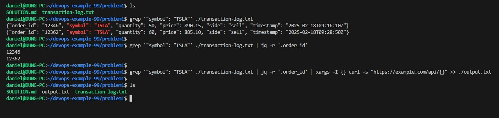

### CLI

```sh
grep '"symbol": "TSLA"' ./transaction-log.txt | jq -r '.order_id' | xargs -I {} curl -s "https://example.com/api/{}" >> ./output.txt
```

- `grep '"symbol": "TSLA"' ./transaction-log.txt`: Filters the lines from `transaction-log.txt` that contain `"symbol": "TSLA"`.

- `jq -r '.order_id'`: Extracts the `order_id` field from the JSON entries using `jq`.

- `xargs -I {} curl -s "https://example.com/api/{}"`: For each `order_id`, it makes an HTTP GET request to `https://example.com/api/{order_id}` using `curl`, appending the results to the `output.txt` file.

- `>> ./output.txt`: Appends the output of the `curl` requests to `output.txt`.


