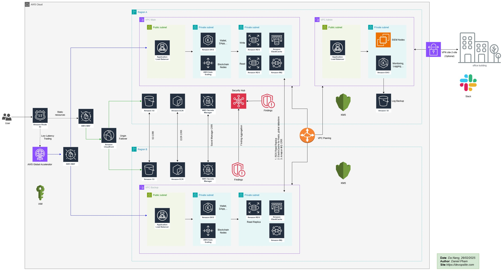

# Architecture

## Components in the system

- We are assuming that we are building a system like Binance, which is fault-tolerant, disaster recovery, highly available, scalable and cost-effective.

- I am assuming that we have a frontend application running with Cloudfront and S3. The trading applications, wallets, dapps, reporting, etc... will be deployed on EKS clusters. The blockchain nodes will run on EC2 instances and ASG.

- This is a basic system that can be visualized, but the actual details of Binance are not published in any documents.

### 1. Distributed layer

#### 1.1 Route53

- This is the DNS service, we will use it to set up DNS records to the system.

#### 1.2 AWS Global Accelerator

- Both `Accelerator` and `Cloudfront` support regional access, reducing latency. But let's assume that the `Throughput is 500 requests per second` and the `Response Time is p99 response time of 100ms`.

- We choose `Global Accelerator` when we have an application that requires extremely low latency and want to optimize global network traffic, especially in cases where we need failover between AWS regions. This is a good choice for real-time applications or those that require intelligent traffic redirection between regions.

- Another advantage of Global Accelerator is that we can disconnect a cluster from the service without interrupting the user transactions. For example, in case we need to upgrade the cluster version, we will disconnect each cluster from Global Accelerator to do so.

#### 1.3 Cloudfront

- Cloudfront is a service that allows serving static resources (e.g. frontend using Angular) quickly, reducing latency and supporting caching.

- We use this service for resources that do not require extremely low latency (e.g. trade) but for static resources such as CSS, JS, images, ... or APIs that allow latency.

- Here, I use Cloudfront combined with origin failover, running with 2 buckets set up `Cross-Region Replication (CRR)`. This ensures that Cloudfront will never be interrupted in case the main bucket fails.

### 2. Main application layer

#### 2.1 Application Load Balancer

- ALB is used here to balance the load to the services inside the EKS cluster and EC2 ASG. It helps to distribute the load of the service evenly to the nodes or pods inside. It ensures that if a node or pod fails, the service will still be up and running as requests are routed to the surviving node/pod.

#### 2.2 EKS clusters

- For EKS clusters, it is especially useful when we use the GitOps model, where all applications are packaged with Helm charts, automatically deployed with ArgoCD. Combined with the DevSecOps pipeline, it will bring maximum automation.

- When deploying EKS, we can put Node Groups inside private subnets to ensure the security of nodes.

- We can use Auto Scaler or Karpenter to automatically scale nodes for the cluster. Combined with the HPA declared in the application's Helm, it will ensure that the application and the cluster are scaled in the best way, according to the traffic or our setup needs.

#### 2.3 EC2 with ASG

- I use EC2 instances combined with ASG for blockchain nodes. There are several reasons for this:

    - Why not run containers on EKS? Blockchain nodes usually have very large size requirements, especially IPFS volumes. So it is basically not suitable to run on EKS clusters.

    - Secondly, every time a blockchain node (for example, an Ethereum node) is initialized, it can take a long time to sync blocks from the network, which can be several hours or several days, depending on many factors.

- So, usually, we will need to run blockchain nodes with EC2.

- So why use ASG if the node cannot be ready in several hours or several days?

    - First, use ASG to try to automate the process of scaling the number of blockchain nodes for the system. Some companies still choose to scale manually, when they receive a resource warning, for example, exceeding the 50% threshold.

    - Second, to use ASG, we need to set up and test a lot of things:
        - `Using Custom AMI (Amazon Machine Image)`: A good solution is to use a custom AMI for your EC2 instances. We can create an AMI of a blockchain node that is fully synchronized to a certain point. Then, new EC2 instances will be able to start from a state that is synchronized with the blockchain (although not completely, it will save time compared to starting from scratch).

        - `Configuring Scaling with Warm-up Time`: configure the `warm-up time` in ASG to ensure that Auto Scaling does not start too many new nodes at the same time without completing the blockchain sync. `Health checks` should be tuned so that the node is not considered unhealthy while it is syncing data, to avoid ASG trying to re-initialize the nodes that are in sync.

        - `Managing latency when adding new nodes`: we can consider scaling the ASG only when the synchronization time reaches a certain threshold, instead of scaling automatically on demand. For example, blockchain nodes can be initialized statically and added to the cluster when the system confirms that it is fully synchronized with the blockchain.

        - `Data Sync with EFS`: to help blockchain nodes share data and state between instances in the ASG, we can use Amazon EFS (Elastic File System). This stores blockchain data and node state in a central location that can be shared with newly initialized nodes.

        - `CDK Erigon`: Consider using CKD Erigon to install blockchain nodes. This is a newly developed technology and it can reduce block sync time to just a few tens of minutes, by applying a new method when determining the block that needs to be synced.

### 3. Database and cache layer

#### 3.1 Aurora RDS multi A-Z

- I use Aurora RDS which supports multi A-Z and cross region Read Replica instance.

- This will ensure our database is always safe when running multi region. With multiple Read instances, the system will be offloaded and optimized query flow according to Write-Read, helping to speed up the application and reduce response time.

#### 3.2 ElastiCache & Amazon MQ

- One of the important issues to reduce load and speed up database queries is to use Cache and Queue.

- Here I use ElastiCache and Amazon MQ multi region with CRR. Requests from the application sent to the database will be put into Amazon MQ queue and cache the results with ElastiCache.

- Combining RDS with the above 2 services helps speed up database queries, minimize errors and data loss when using queues.

- These services when setting up CRR will support the system running multi region. When one region has a problem, the other region will continue to operate and serve users.

### 4. General Services

#### 4.1 VPC peering

- Because of this architecture, I am setting up to run multiple regions and multiple VPCs. To ensure local access between services, including the main application, I used VPC Peering to connect the VPCs together.

- AWS has another option, which is Transit Gateway, this service is suitable when we have many regions and many VPCs that need to connect together, it will do it better than VPC Peering. But in return, it will be more expensive than VPC Peering.

- Here, I only have 2 regions with 3 VPCs, using VPC Peering will be more economical.

- Another requirement that I am wondering about when wanting to include is the use of VPC Endpoints. For systems that require high security, such as trade, banking, ..., the use of endpoints is considered almost a standard. It allows AWS services to connect to each other locally, without going out to the internet, which ensures that information is not listened to when transmitted over the internet, increasing security. But it has the disadvantage of being quite expensive for VPC services. I decided not to include it when other solutions were used, temporarily balancing safety and cost.

#### 4.2 Elastic Container Registry (ECR)

- This is an indispensable service when the system is built with a container environment, whether EKS or ECS. We need to use private repositories on ECR to store application images, from which we can deploy it to the EKS cluster.

- The ECR service here I also chose to set up CRR so that it stores images between regions, which both helps ensure safety in case of errors and speeds up application deployment.

#### 4.3 Secret Manager

- This is an important service used to store secrets used in the system, for example, credentials of RDS, EKS,...

- For applications running inside EKS, we can combine `External Secrets Operator` and `AWS Secret Manager `service to store application secrets. Instead of creating resource `kind: Secret` directly inside EKS, it is not secure enough.

- In case we do not want to use Secret Manager (for example multi cloud system), we can consider using HashiCorp Vault as a centralized secret management service.

#### 4.4 Key Management Service (KMS)

- Another important thing when deploying the service is to use KMS to encrypt the information. This helps ensure that the transmitted data is not leaked and the services need to have permission to read the data.

#### 4.5 Amazon S3

- I use S3 here for 2 purposes:

    - 2 buckets for frontend applications when combined with Cloudfront origin failover.

    - 1 bucket is used to backup logs from the Logging system in VPC Admin.

### 5. Security solutions

- For an IT system today, security is a vital issue for businesses but has not been given due attention.

- There are many businesses that collapse immediately because of a security incident.

- Here, I have created an additional `VPC Admin` in `region A`, to serve support services for Monitoring, Logging, SIEM,... We will review some of the solutions that I mentioned in the above architecture.

#### 5.1 WAF

- I used WAF when serving traffic related to Cloudfront and Global Accelerator. WAF helps prevent network attacks that occur at layer.

- Meanwhile, Cloudfront and Global Accelerator help prevent DDoS attacks with the integrated Shield service (basic).

#### 5.2 Separate VPCs and Private subnets

- As a reminder, using separate VPCs and placing critical services in private subnets is a basic standard. It reduces attacks/scans from the internet, prevents the spread of malware when services are located in different subnets.

#### 5.3 KMS and Secret Manager

- As a reminder, combining these two services helps keep important information confidential, especially credentials, configurations, and keys. At the same time, encrypt data during movement and connection between AWS services.

#### 5.4 Security Hub

- Using Security Hub will help the system easily detect security vulnerabilities on AWS infrastructure. We can activate standards such as NIST, CIS... inside Security Hub. However, using this service may cost a fee. Balancing security and cost is always a difficult point.

#### 5.5 SIEM & Monitoring, Logging

- Normally, I will install the monitoring support system as follows:

    - SIEM using Wazuh, it tells me the status of nodes, services in the system. It supports proactive response when there is an attack, and it can also scan the system according to standards such as CIS,...

    - Monitoring with Prometheus, Grafana and Alert Manager stack installed on EKS cluster. It will help me monitor all system resources and alert when there is a problem. Alerts will be sent to Slack.

    - Logging system will be installed with ELK or EFK stack on EKS cluster. It will collect logs from the entire application, we can analyze and build dashboard, send alerts based on logs. Here, I use 1 S3 bucket (mentioned before) to backup log data.

#### 5.6 VPN Site-to-Site

- This is an option if we want encrypted data from the office to AWS. However, it will cause a lot of costs so I will leave it as an option.

- Because in fact, we can use other VPN solutions such as Tailscale or OpenVPN for example. It still ensures the security when connecting from the office to AWS for administrative operations and saves costs.

- But above all, an idea of ​​​​encrypting data when the Admin works is necessary, combined with IAM authorization and additional MFA solutions (even requiring the use of USB keys).

## Alternatives and scalability

- Here are some alternative services:

| AWS Services | Alternative Services | Reasons |
| ----- | ----- | ----- |
| Cloudfront + S3 | Cloudflare Page + CDN | We can consider using Cloudflare Page and its CDN with lower cost and more effective anti-DDoS support with features such as anti-Bot, Rate... |
| Security Hub | SIEM Wazuh | It would be better to use both together. But if you need to reduce costs, you can replace Security Hub with SIEM Wazuh, which will still ensure standard security scanning. |
| AWS VPN Site-to-Site | Tailscale/OpenVPN | As started earlier, cheaper Client-to-Site VPN services can be used in cases where cost cutting is needed. |

- The system has been pre-set with multi region, multi zone so the ability to scale is ready at all layers.

- In case of expansion, we just need to add resources to each layer. However, parameters from the monitoring system are needed to ensure the correct scaling as required.
